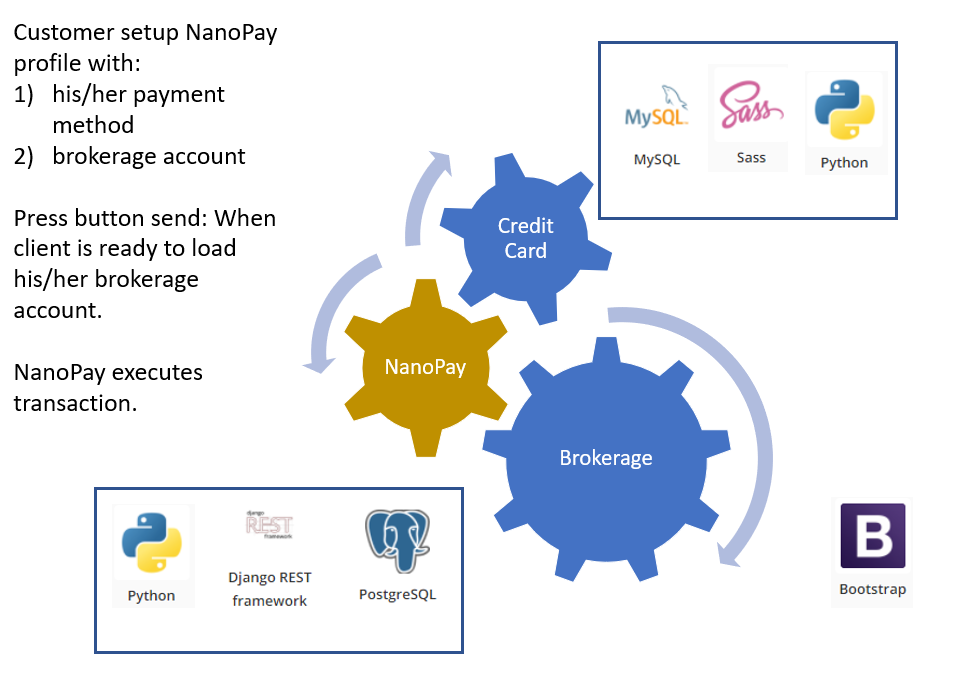

# Case Study for NanoPay

## Overview and Origin

* Name of the company: NanoPay
* Founded on 2012 by Laurence Cooke 
* Headquartered in Toronto, Canada.
* The company was created with the objective of building a money transfer platform using hybrid blockchain and traditional databases.
* The company got funded throught 4 rounds, receiving aprox. USD MM$10.5 [[3]](https://www.crunchbase.com/discover/funding_rounds/8d71b32ab082c9d5aa46d78f67aabe6e)

## Business Activities:

* NanoPay is a Global payment company based on hybrid blockchain technology to execute
money transfers B2B and ensure trackability and fast completion.

* The company intended customer is Businesses that send / receives frequent money transferences and desire to reduce costs and improve performance (2,500X faster).

* NanoPay relies on its in-house Centralized Ledger Technology (NanoRail) which minimizes lag time between operations.

* Technologies used: UIkIt (for fast web interfaces), Bootstrap (Web coding components- HTML, CSS and JS),nginx (free open source web server), php (Web development language) and Goodle Analytics (web analytics) .[[6]](https://stackshare.io/nanopay/nanopay)

## Landscape:

* NanoPay is in the payment technology sector, sector that has rapidly evolve. Since its infancy e-mail payment (paypal), payment services has rapidly grown into shaping the banking and credit union industry with sharp and constant innovation. According to Deloitte, the `"dynamic payment industry continue to expand and evolve with digital payment vehicles and transaction volumes growing across the globe". `[[7]](https://www2.deloitte.com/us/en/pages/financial-services/articles/infocus-payments-trends.html)

* In their 2020 Payment trend report, Deloitte afirms that big banks and credit unions need to modernize their infracstructure (including: cloud computing, digital technology, etc ) to offer new services so that they can attract technology savvy customers to increase their revenues streams. In order to do that those banks may be inclined to acquire early stages Fintech companies that are in payment and processing sector.

* Similar forecasting are found across the web. In an article dedicaded to the payment field,  bluesnap reported [[9]](home.bluesnap.com/snap-center/blog/9-payment-trends-that-will-shape-2020/):

> In 2019, Gen Z represented around $350 billion of spending power in the U.S. alone. This trend is only going to speed up: by 2020 Gen Z will account for 40% of global consumers.

* Gen Z consumers prefer utilizing a single app to complete their transactions; so a Fintech payment company that offers an unified digital payment system may be able to compete for this type of customer.

* In regards to competitors, there are several major companies established on this domain: Paypal, Circle, Remitly, Stripe, Braintree, Aeropay, DailyPay, Bolt, Ripple, affirm, Plastiq to name a few.  [[8]](builtin.com/fintech/fintech-payments-companies-examples)

## Results:

* NanoPay has remained in its early stage phase since incorporating in 2012. However, Their sales effort is focused on offering solutions to business costumers in the e-commerce field.  

* It is unavoidable to compare the 8-year old payment service NanoPay with its predecessor Paypal, which four years after being founded (in 2012) got its 1st IPO and became a subsidiary of its until then sole customer (eBay)[[10]](https://en.wikipedia.org/wiki/PayPal) and spanning a value of $1.5 Billion. On these terms, NanoPay annual revenue of ~ $420K/year indicates that e-commerce dependant business model may not be enough to survive on this highly competitive sector.[[4]](https://www.dnb.com/business-directory/company-profiles.nanopay_holdings_inc.ea9b76f27b0e17a1b50d1c2b2ed3a8df.html#company-info)

* In terms of customer growth, there is no information of the number of customer, however comparing its 2019 annual revenues against its 8-year-old pier: Plastiq.com, seems to indicate lack of new businesses [[11]](https://en.everybodywiki.com/Plastiq).   

## Recommendations:

* I would recommend to develop a product line geared toward attracting a growing consumer based, like the Gen Z, which already accounts for 40% of global consumer market share while at the same time utilizing the customer phone knowledge capabilities or technology user savviness on digital platforms.

* One line of product that I proposed being integrated with NanoPay is connecting payment services with trading brokerage companies (e.g Robinhood), and combined it with bank integration so that customers could load their brokerages trading accounts with their credit cards. This in turn would reduce dependancy on a single type clientele. 

* To accomplish this, I envision integrating the following: open source database (like MySQL or PostgreSQL), Sass (Style Sheets) and Django framework for webAPIs. Refer to Diagram 1 (below).

### Diagram 1 - Technologies

_____

### Sources:
[1] (https://www.nanopay.net)

[2] (https://ca.linkedin.com/company/nanopay)

[3] (https://www.crunchbase.com/discover/funding_rounds/8d71b32ab082c9d5aa46d78f67aabe6e)

[4] (https://www.dnb.com/business-directory/company-profiles.nanopay_holdings_inc.ea9b76f27b0e17a1b50d1c2b2ed3a8df.html#company-info)

[5] (https://www.zoominfo.com/c/nanopay-corporation/358038250)

[6] (https://stackshare.io/nanopay/nanopay)

[7] (https://www2.deloitte.com/us/en/pages/financial-services/articles/infocus-payments-trends.html)

[8] (https://builtin.com/fintech/fintech-payments-companies-examples)

[9] (https://home.bluesnap.com/snap-center/blog/9-payment-trends-that-will-shape-2020/)

[10] (https://en.wikipedia.org/wiki/PayPal).

[11] (https://en.everybodywiki.com/Plastiq)

 
